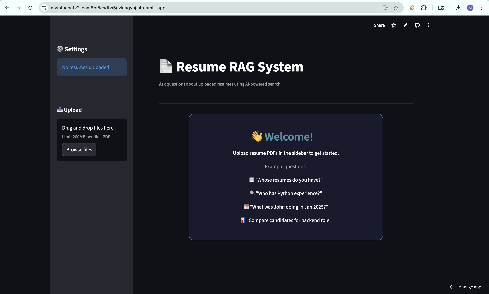
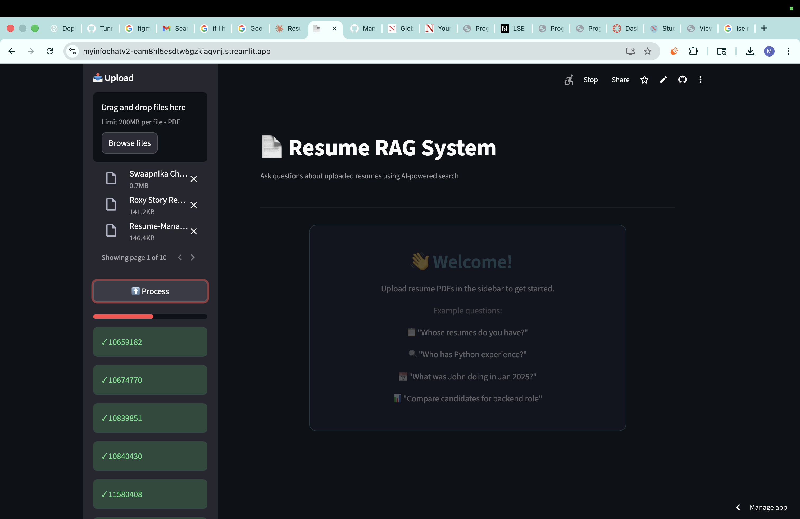
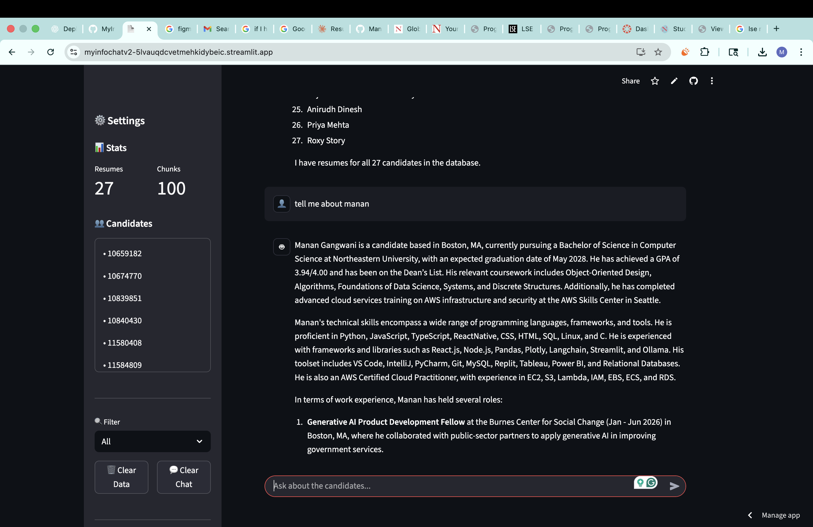

# Resume RAG System

An AI-powered resume chatbot that lets you upload resumes and ask natural language questions about candidates.


## 🚀 Local App

Run locally at `http://localhost:5050`.

---

## 📋 Features

- **Upload Multiple Resumes** - Supports PDF files, handles 20+ resumes
- **Natural Language Queries** - Ask questions in plain English
- **Smart Search** - Hybrid semantic + keyword search
- **Candidate Comparison** - Compare candidates side by side
- **Skill Matching** - Find candidates with specific skills
- **Conversation Memory** - Understands follow-up questions and pronouns
- **Resume Validation** - Automatically rejects non-resume documents

### Example Questions You Can Ask:
- "Whose resumes do you have?"
- "Who has Python experience?"
- "Tell me about John's background"
- "Compare the candidates for a backend role"
- "Who would be best for a data science position?"
- "What was she doing in Jan 2025?" (uses conversation context)
- "Who has AWS and React experience?"

---

## 🛠 Tech Stack

| Component | Technology |
|-----------|------------|
| **Frontend** | React + Tailwind CSS |
| **Backend** | FastAPI |
| **LLM** | OpenAI GPT-4o |
| **Vector Database** | ChromaDB |
| **PDF Processing** | PyPDF2 |
| **Language** | Python 3.11.9 |

### Architecture

```
┌─────────────────┐     ┌─────────────────┐     ┌─────────────────┐
│                 │     │                 │     │                 │
│   PDF Upload    │────▶│  Text Chunks    │────▶│   ChromaDB      │
│                 │     │  + Metadata     │     │   (Vectors)     │
└─────────────────┘     └─────────────────┘     └─────────────────┘
                                                        │
                                                        ▼
┌─────────────────┐     ┌─────────────────┐     ┌─────────────────┐
│                 │     │                 │     │                 │
│   Response      │◀────│    GPT-4o       │◀────│  Hybrid Search  │
│                 │     │                 │     │ (Semantic+KW)   │
└─────────────────┘     └─────────────────┘     └─────────────────┘
```

---

## 📦 Installation

### Prerequisites
- Python 3.11.9 or higher
- OpenAI API key

### Steps

1. **Clone the repository**
```bash
git clone https://github.com/yourusername/resume-rag.git
cd resume-rag
```

2. **Create virtual environment**
```bash
python -m venv venv
source venv/bin/activate  # On Windows: venv\Scripts\activate
```

3. **Install dependencies**
```bash
pip install -r requirements.txt
```

4. **Set up environment variables**
```bash
# Create .env file
cat > .env <<EOF
OPENAI_API_KEY=your_api_key_here
TAVILY_API_KEY=your_tavily_api_key_here
EOF
```

5. **Run the application**
```bash
python3 resume_rag.py
```

The app will open at `http://localhost:5050`

---

## 📁 Project Structure

```
resume-rag/
├── resume_rag.py       # FastAPI backend + chat logic
├── templates/
│   └── index.html      # Tailwind + React shell
├── static/
│   └── react_app.js    # React UI logic
├── requirements.txt    # Python dependencies
├── .env               # Environment variables (not in repo)
├── .gitignore         # Git ignore file
├── README.md          # This file
├── chroma_db/         # Vector database storage (auto-created)
```

---

## 🔧 Configuration

| Setting | Default | Description |
|---------|---------|-------------|
| Chunk Size | 300 words | Size of text chunks for processing |
| Chunk Overlap | 75 words | Overlap between consecutive chunks |
| Max Chunks to LLM | 70 | Maximum chunks sent to GPT-4o |
| Conversation History | 5 | Number of previous Q&A pairs remembered |

---

## 📸 Screenshots

### Main Interface


### Upload Resumes


### Search Results

